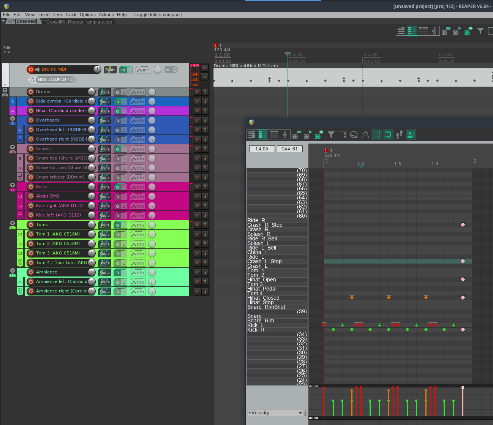

# drumgizmo-aasimonster-reaper

A Reaper template for the drumgizmo [aasimonster kit](https://www.drumgizmo.org/wiki/doku.php?id=kits:the_aasimonster) and a midi note map.

Created using the [Crockell drumkit reaper template](https://drumgizmo.org/kits/CrocellKit/CrocellKit-Reaper_template.rpp) and eq effects as a basis. I'm by no means a drum expert, so feel free to chime in with suggestions for further improvements to both the template and the midi names.
