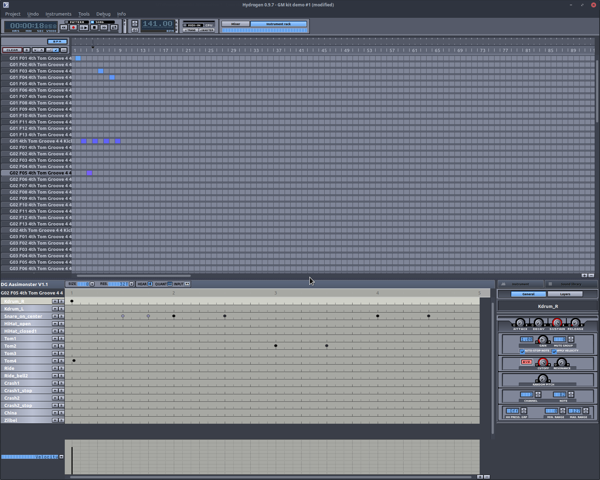

# drumgizmo-aasimonster-reaper

A Reaper template for the drumgizmo [aasimonster kit](https://www.drumgizmo.org/wiki/doku.php?id=kits:the_aasimonster) and a midi note map.

I'm by no means a drum expert, so feel free to chime in with suggestions for further improvements.

# hydrogen drum machine songs for mt power drum kit grooves

Holds midi grooves and fills found in the mt power drum kit lib converted to hydrogen songs, one per category of grooves/fills, each with loads of hydrogen patterns.

Open hydrogen 'Project -> Open` and choose one of the .h2songs to expose all fills and grooves from each category.

The full list of hydrogen songs:

- 4_4 GROOVES 160 - 250 bpm/4th Bell/4th Bell.h2song
- 4_4 GROOVES 160 - 250 bpm/4th China/4th China.h2song
- 4_4 GROOVES 160 - 250 bpm/4th Closed Hi-Hat/4th Closed Hi-Hat.h2song
- 4_4 GROOVES 160 - 250 bpm/4th Crash R/4th Crash R.h2song
- 4_4 GROOVES 160 - 250 bpm/4th Half Open Hi-Hat/4th Half Open Hi-Hat.h2song
- 4_4 GROOVES 160 - 250 bpm/4th Open Hi-Hat/4th Open Hi-Hat.h2song
- 4_4 GROOVES 160 - 250 bpm/4th Ride/4th Ride.h2song
- 4_4 GROOVES 160 - 250 bpm/4th Tom Grooves/4th Tom Grooves.h2song
- 4_4 GROOVES 160 - 250 bpm/8th Closed Hi-Hat/8th Closed Hi-Hat.h2song
- 4_4 GROOVES 160 - 250 bpm/8th Half Open Hi-Hat/8th Half Open Hi-Hat.h2song
- 4_4 GROOVES 160 - 250 bpm/8th Tom Grooves/8th Tom Grooves.h2song
- 4_4 GROOVES 160 - 250 bpm/Intro/Intro.h2song
- 4_4 GROOVES 60 - 150 bpm/16th Closed Hi-Hat/16th Closed Hi-Hat.h2song
- 4_4 GROOVES 60 - 150 bpm/8th _ 16th Tom Grooves/8th _ 16th Tom Grooves.h2song
- 4_4 GROOVES 60 - 150 bpm/8th Bell/8th Bell.h2song
- 4_4 GROOVES 60 - 150 bpm/8th China/8th China.h2song
- 4_4 GROOVES 60 - 150 bpm/8th Closed Hi-Hat/8th Closed Hi-Hat.h2song
- 4_4 GROOVES 60 - 150 bpm/8th Crash R/8th Crash R.autosave.h2song
- 4_4 GROOVES 60 - 150 bpm/8th Crash R/8th Crash R.h2song
- 4_4 GROOVES 60 - 150 bpm/8th Half Open Hi-Hat/8th Half Open Hi-Hat.autosave.h2song
- 4_4 GROOVES 60 - 150 bpm/8th Half Open Hi-Hat/8th Half Open Hi-Hat.h2song
- 4_4 GROOVES 60 - 150 bpm/8th Open Hi-Hat/8th Open Hi-Hat.h2song
- 4_4 GROOVES 60 - 150 bpm/8th Ride/8th Ride.autosave.h2song
- 4_4 GROOVES 60 - 150 bpm/8th Ride/8th Ride.h2song
- 4_4 GROOVES 60 - 150 bpm/Intro/Intro.h2song
- 4_4 GROOVES SHUFFLE 80 - 180 bpm/8th Bell SHUFFLE/8th Bell SHUFFLE.h2song
- 4_4 GROOVES SHUFFLE 80 - 180 bpm/8th China SHUFFLE/8th China SHUFFLE.h2song
- 4_4 GROOVES SHUFFLE 80 - 180 bpm/8th Closed Hi-Hat SHUFFLE/8th Closed Hi-Hat SHUFFLE.h2song
- 4_4 GROOVES SHUFFLE 80 - 180 bpm/8th Crash R SHUFFLE/8th Crash R SHUFFLE.h2song
- 4_4 GROOVES SHUFFLE 80 - 180 bpm/8th Half Open Hi-Hat SHUFFLE/8th Half Open Hi-Hat SHUFFLE.h2song
- 4_4 GROOVES SHUFFLE 80 - 180 bpm/8th Open Hi-Hat SHUFFLE/8th Open Hi-Hat SHUFFLE.h2song
- 4_4 GROOVES SHUFFLE 80 - 180 bpm/8th Ride SHUFFLE/8th Ride SHUFFLE.h2song
- 4_4 GROOVES SHUFFLE 80 - 180 bpm/Intro SHUFFLE/Intro SHUFFLE.h2song
- 6_8 GROOVES 60 - 150 bpm/16th Closed Hi-Hat 6_8/16th Closed Hi-Hat 6_8.h2song
- 6_8 GROOVES 60 - 150 bpm/8th Bell 6_8/8th Bell 6_8.h2song
- 6_8 GROOVES 60 - 150 bpm/8th China 6_8/8th China 6_8.h2song
- 6_8 GROOVES 60 - 150 bpm/8th Closed Hi-Hat 6_8/8th Closed Hi-Hat 6_8.h2song
- 6_8 GROOVES 60 - 150 bpm/8th Crash R 6_8/8th Crash R 6_8.h2song
- 6_8 GROOVES 60 - 150 bpm/8th Half Open Hi-Hat 6_8/8th Half Open Hi-Hat 6_8.h2song
- 6_8 GROOVES 60 - 150 bpm/8th Open Hi-Hat 6_8/8th Open Hi-Hat 6_8.h2song
- 6_8 GROOVES 60 - 150 bpm/8th Ride 6_8/8th Ride 6_8.h2song
- 6_8 GROOVES 60 - 150 bpm/8th Tom Grooves 6_8/8th Tom Grooves 6_8.h2song
- 6_8 GROOVES 60 - 150 bpm/Intro 6_8/Intro 6_8.h2song

Credits:
- a script off of the linuxmusicians forum to [convert mt power drum grooves to midi](https://linuxmusicians.com/viewtopic.php?p=71442#p71442)
- [midi2hydro_pattern](https://github.com/brandjamie/midi2hydro_pattern)
- Created using the [Crockell drumkit reaper template](https://drumgizmo.org/kits/CrocellKit/CrocellKit-Reaper_template.rpp)

